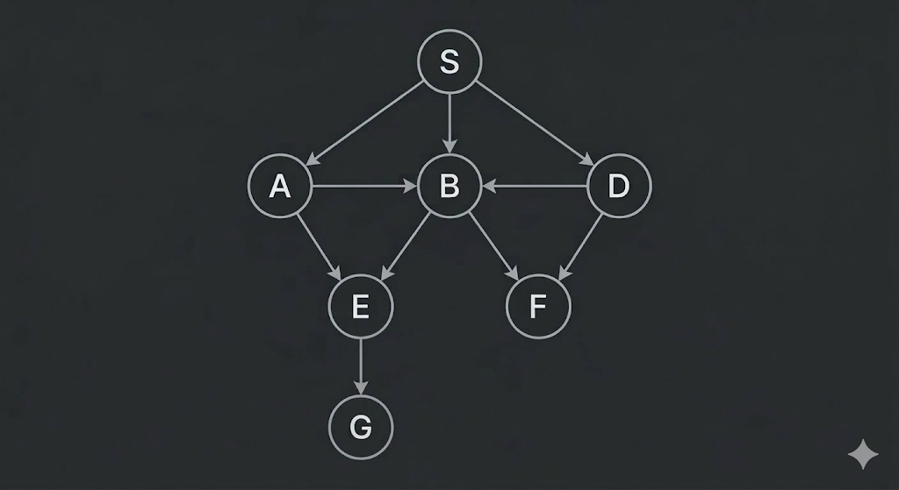
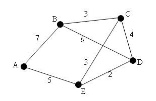

# Parcours de graphes

On veut appliquer une fonction f à tous les sommets d'un graphe (connexe)

__Exemple de graphe__ :

{width=400px height=300px}

## Algo générique de parcours

On dispose d'un "sac" qui contient les sommets à visiter d'une structure qui contient les sommets déjà visités.

__**Algo**__ :

```
Mettre le sommet source dans le sac

WHILE le sac n'est pas vide
  Prendre un sommet du sac
  SI ce sommet n'est pas dans la structure des sommets visités
    Appliquer f à ce sommet
    Ajouter ce sommet à la structure des sommets visités
    Mettre tous les voisins de ce sommet dans le sac
  SINON
    Passer au sommet suivant (On fait rien)
```

__**Exemple sur le graphe**__ :

### Parcours en largeur (BFS) du graphe

## Initialisation

- __File__ : [S]  
- __Visités__ : []

---

## Étapes détaillées

### Étape 1

- File avant : [S]  
- Sommet pris : S  
- Action : visiter S, ajouter A, B, D  

- __File après__ : [A, B, D]  
- __Visités__ : [S]

---

### Étape 2

- File avant : [A, B, D]  
- Sommet pris : A  
- Action : visiter A, ajouter B, E  

- __File après__ : [B, D, B, E]  
- __Visités__ : [S, A]

---

### Étape 3

- File avant : [B, D, B, E]  
- Sommet pris : B  
- Action : visiter B, ajouter E, F  

- __File après__ : [D, B, E, E, F]  
- __Visités__ : [S, A, B]

---

### Étape 4

- File avant : [D, B, E, E, F]  
- Sommet pris : D  
- Action : visiter D, ajouter B, F  

- __File après__ : [B, E, E, F, B, F]  
- __Visités__ : [S, A, B, D]

---

### Étape 5

- File avant : [B, E, E, F, B, F]  
- Sommet pris : B  
- Action : déjà visité → rien  

- __File après__ : [E, E, F, B, F]  
- __Visités__ : [S, A, B, D]

---

### Étape 6

- File avant : [E, E, F, B, F]  
- Sommet pris : E  
- Action : visiter E, ajouter G  

- __File après__ : [E, F, B, F, G]  
- __Visités__ : [S, A, B, D, E]

---

### Étape 7

- File avant : [E, F, B, F, G]  
- Sommet pris : E  
- Action : déjà visité → rien  

- __File après__ : [F, B, F, G]  
- __Visités__ : [S, A, B, D, E]

---

### Étape 8

- File avant : [F, B, F, G]  
- Sommet pris : F  
- Action : visiter F  

- __File après__ : [B, F, G]  
- __Visités__ : [S, A, B, D, E, F]

---

### Étape 9

- File avant : [B, F, G]  
- Sommet pris : B  
- Action : déjà visité → rien  

- __File après__ : [F, G]  
- __Visités__ : [S, A, B, D, E, F]

---

### Étape 10

- File avant : [F, G]  
- Sommet pris : F  
- Action : déjà visité → rien  

- __File après__ : [G]  
- __Visités__ : [S, A, B, D, E, F]

---

### Étape 11

- File avant : [G]  
- Sommet pris : G  
- Action : visiter G  

- __File après__ : []  
- __Visités__ : [S, A, B, D, E, F, G]

---

## Ordre final du parcours

S → A → B → D → E → F → G

### Version fonctionnelle du parcours en largeur (BFS)

On utilise une fonction récursive qui parcourt sommet S et tout les vois de S non encore traités.

```
parcourt(s) =
  SI S a déjà été traité
    On fait rien
  SINON
    On ajoute S à la structure des sommets traités
    On applique f à S
    POUR TOUS les voisins V de S
      parcourt(V)
```

## Algo de kruskal

Fabrication d'un arbre couvrant minimal.

Entrée : Un graphe valué connexe non orienté



Sortie : Arbre couvrant minimal = graphe connexe minimal contenant tous les sommets de G (et une sélécton bien choisie des arêtes de G)

__**Algo**__ :

```
TANT QUE le graphe est en fabrication (= n'est pas connexe)
  On choisit une arête de poids minimal
  SI cette arête sert à qqchose (c'est à dire que les deux sommets de cette arête ne sont pas déjà connectés dans le graphe en fabrication, donc pas encore dans la composante connexe)
    On ajoute cette arête au graphe en fabrication
  SINON
    On fait rien
```
